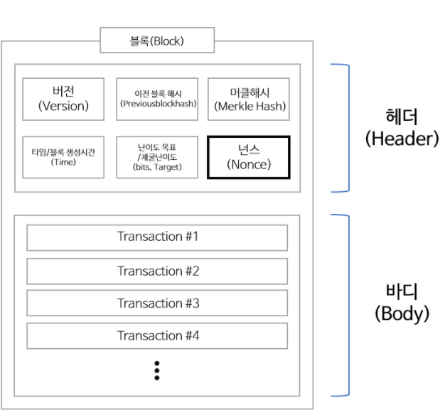

# block chain

> 학부시절 정보보호 수업이 인기가 많아 수많은 경쟁자들을 제치고 들을 수 있었던 수업이 이론적으로  많이 도움이 되었던 것 같습니다.
>
> 하지만 코드로 직접 구현해 볼 생각은 해보지도 못했고 그럴 시간과 노력을 쏟아내지 못해서 그런지 이번 프로젝트가 조금 특별하게 느껴지네요.
>
> 최대한 대학생시절 기억을 더듬어 기록해 놓도록 하겠습니다. 🙂

## 1. 블록체인이란?

블록체인은 관리 대상 데이터를 '블록'이라고 하는 소규모 데이터들이 P2P 방식을 기반으로 생성된 체인 형태의 연골고리 기반 분산데이터 저장 환경에 저장하여 누구라도 임의로 수정 할 수 없고 누구나 변경의 결과를 열람할 수 있는 분산 컴퓨팅 기술 기반의 원장 관리 기술입니다. 

이는 근본적으로 분산 데이터 저장기술의 한 형태로, 지속적으로 변경되는 데이터를 모든 참여 노드에 기록한 변경 리스트로서 **분산 노드의 운영자에 의한 임의조작이 불가능하도록 고안되었습니다. **

쉽게 말해 분산 데이터 저장소가 한 번에 같은 값을 기록하며 업데이트 되므로 임의 조작이 될 경우,  분산 데이터 저장소끼리 데이터의 내용이 맞지 않게 됩니다. 

따라서 데이터가 변형이 되었는지, 되지 않았는지 쉽게 알 수 있습니다.  

블록체인 기술은 비트코인을 비롯한 대부분의 암호화폐 거래에 사용된다. 암호화페의 거래과정은 탈중앙화 된 전자장부에 쓰이기 때문에 블록체인 소프트웨어를 실행하는 많은 사용자들의 각 컴퓨터에서 서버가 운영되어, 중앙에 존재하는 은행 없이 개인 간의 자유로운 거래가 가능합니다. 

중앙화 된 전자장부의 예로는 은행이나 기업에서 전자기록된 장부를 관리하기 때문에 중앙화 된 장부가 해킹 당하면 장부의 내용을 순수하게 돌릴 수 없다. 다른 저장소에 백업을 시켜놨다고 해도 보안적으로 해킹당하지 않을거란 보장이 없기 때문입니다. 

따라서 탈중앙화 된 전자장부에 쓰이는 블록체인의 관심이 집중되는 건 자연스러운 현상인 것 같습니다.

또한 소프트웨어의 기본적인 기능인 Create, Update, Read, Delete 중 Delete의 기능이 없어 지워지면 안되는 중요한 정보를 기록해 두는데 최적화 되어 있는 기술입니다. 

이런 블록체인의 역할이 사회적으로 긍정적인 영향을 미치기도 하지만 신기술을 부정적으로 이용하는 사례도 많이 발견됩니다.

기술의 발전과 함께 나쁜 생각을 하는 사람들도 같이 발전하는 것 같아 씁쓸해 지네요.

###  1.1 블록과 체인 구현 

둘을 나눠서 생각해 봅시다.

- 블록 : 관리 대상 데이터
- 체인 : 연결고리 

블록체인을 위의 단어 그대로 해석 해 보면 **데이터와 연결고리**로 정의 할 수 있습니다.

코드롣 구현하려고 생각해본다면 구조체(객체) 값에 링크드 리스트로 엮은 모습과 비슷할 것 같습니다. 

모습이 비슷하다는 거지 실제로는 **포인터 참조(주소값 참조)가 아닌 해시값 참조(데이터를 암호화시킨 값)**로 연결되어 있습니다. 

`해시함수란 임의의 길이의 데이터를 고정된 길이의 데이터로 매핑하는 함수이다 `

쉬운 예로 나머지(modulas)를 들 수 있습니다.

n 값의 나머지 m을 구하면 0 ~ m-1 범위의 값이 구해집니다. n을 1로 줘도 되지만 엄청 큰 수를 준다고 해도 결과값은 0 ~ m-1 범위의 값일 뿐입니다. 

m값만으로는 n값을 정확히 되돌리지 못합니다. 

해시함수는 아래와 같은 특징이 있습니다.

**해시 함수의 특징**

1. 뭘 넣든 비슷한 길이의 알 수 없는 난수가 결과로 출력이 된다. 
   - 들어가는 데이터 블럭이 작던지 크던지 일정한 크기의 난수값으로 나와야 한다.
2. 글자가 한글자만 바뀌어도 완전히 다른 결과가 출력 된다. 
   - 원본 데이터 값이 1에서 2로 바뀌었다고 해시함수를 거쳐 나온 값이 1증가하는 그런 형태, 즉 원본데이터가 가지고 있는 규칙을 난수 데이터가 가지고 있으면 안된다. 

3. 출력값으로 입력값을 예측할 수 없다.
   - 정말 연관 없는 데이터로 가공되어 나와야 한다.
4. 같은 내용을 입력값으로 주면 결과값은 항상 같다. 
   - 데이터를 가공하는 해시함수의 규칙은 동일해야한다.

블록에는 어떠한 데이터가 담겨있겠지만 이것을 해시하면 결국 고정된 길이의 해시값이 나올 것입니다.

### 1.2 블록 구현 

블록은 구조체로 표현 할 수 있습니다. 그럼 구조체 안에는 어떠한 내용들을 넣을 수 있을까요 

1. 이전 블록의 해시값을 기억할 변수 
   - 이전 블록이 전혀 상관 없는 데이터가 아니라 내가 숨기고 싶어 했던 원본데이터를 비밀스럽게 가공해서 전 블록에서 넘겨준 값 
2. 현재 블록에서 간직해야 할 데이터 
   - 전 블록에서 넘겨준 값을 가공해서 다음 블록에 넘겨줘야 하는 값

위의 두 가지 변수는 반드시 블록체인 기법에서 가지고 있어야 할 것입니다. 

### 1.3 블록체인 구현

그렇다면 블록체인을 어떻게 구현해야할까요?

블록을 생성하였다면 직전에 만든 블록과 관계를 맺어줘야 합니다. 그 관계는 해시값을 통해서 가질 수 있습니다.

이전의 블록 해시값을 현재의 블록이 기억을 해둡니다. 

그리고 그렇게 생성된 블록의 해시값은 또 다음 블록이 기억을 할 것입니다. 이렇게 블록생성 마다 이런 과정을 반복적으로 해줌으로써 블록간의 관계

즉, 체인으로 엮은 듯이 관계를 맺게 되고 이를 블록체인이라고 합니다.

단 하나 예외적인 경우는 첫 블록을 만들 때입니다. 이 때는 이전의 블록 없기에 해시값도 없습니다. 

이런 경우는 empty 값(null 과는 다른) 혹은 random값을 넣어주면 됩니다. 앞으로의 반복되어질 블록체인의 과정 속에 던져질 최초 씨앗이 되는 브록이기에 이 블록의 직전 블록이라는 것은 의미가 없습니다. 

이렇게 **최초로 만든 블록을 Genesis 블록**이라고 합니다.

### 2. 작업증명(Proof of Work)

위의 과정까지가 문자 그대로 블록체인을 구현하였다고 볼 수 있다면 너무 단순하여 실용성이 없습니다.

이제 조금씩 이해의 범위를 넓혀 나가 봅시다! 

### 블록을 수정(Update)하였다면?

최초의 블록해시 값은 2번쨰 블록에서 기억하고 있습니다.

그런데 최초의 블록값이 1byte라도 달라진다면 해시값은 완전히 달라질 것입니다. (해시의 특징2번참고)

그래서 2번째 블록에서 이 변경된 해시값을 previous 해시값으로 변경 한다면 3번째 블록도 해시값이 바뀌게 될 것 입니다. 

**이런 식으로 블록간에는 해시로 연결되어 있어서 이전의 블록을 변경한다는 것은 이후의 블록 모두가 변경되어야 한다는 것을 의미합니다. 이후의 블록 개수가 많으면 많아질수록 부담이 될 것입니다. **

하지만 현대컴퓨터는 무척 빠르기 때문에 블록을 만들 때 너무 빠르게 만들지 못하게 만들어야 합니다.

일종의 숙제(work)를 줘서 빠른 시간내로 만들지 못하게 해야합니다. 

### Nonce 

블록 체인이 신뢰의 원천이 될 수 있는 첫번째 핵심 요소는 작업증명(Proof of Work)입니다.

블록헤더를 해쉬

개별 거래 정보는 결국 머클 트리의 해쉬값인 `merklehash` 값으로 집약됩니다. 

블록 헤더의 6가지 정보 중에서 `version`, `previousblockhash`, `merklehash`, `time`, `bits` 이렇게 5가지는 블록 해쉬를 만드는 시점에서 이미 확정되어 변하지 않는 값이다. 

하지만 마지막 `nonce`는 확정되어 있지 않고 새로 구해야 하는 값입니다. 

**이 `nonce` 값을 구해서 최종적으로 블록 해쉬 값을 구하고, 이 블록 해쉬값을 식별자로 가지는 유효한 블록을 만들어내는 것이 바로 작업 증명(Proof of Work), 흔히 말하는 채굴**입니다.

`nonce`값을 구해서 최종적으로 블록 해쉬값을 구하고, 이 블록 해쉬값을 식별자로 가지는 유효한 블록을 만들어내는 것이 작업증명이다.

결국 `nonce`값을 구하는 것이 작업 증명의 핵심입니다. 

`nonce`값이란 어떤 값을 의미하는지 알아야 합니다.

`nonce`값은, 이 `nonce`값을 입력값 중의 하나로 해서 계산되는 블록 해쉬값이 특정 숫자보다 작아지게 하는 값을 말합니다. 

해쉬함수의 특성상 어떤 해쉬값(A라고 하면)을 결과로 나오게 하는 입력값을 찾으려면, A에서 역산을 하는 방식으로는 찾을 수 없고, 결과가 A가 될 때까지 무작위로 입력값을 계속 바꿔가면서 해쉬값을 계산해 보면서 찾아낼 수 밖에 없습니다. 

그렇다면 어떤 블록 해쉬값이 어떤 특정 숫자보다 작아지게 하려면, 블록 해쉬의 입력값을 계속 바꿔가면서 구한 해쉬값이 특정 숫자보다 낮은지 비교하는 작업을 계속 반복하는 수 밖에 없습니다.

블록 해쉬의 입력값은 블록 헤더고, 블록 헤더에는 6가지 정보가 담겨 있으며, 이 중에서 5가지는 값이 고정되어 변경할 수 없고, 오직 `nonce`만 값을 바꿀 수 있습니다.

즉, 이 `nonce`값을 계속 바꿔가면서 계산한 해쉬값이 어떤 특정 숫자보다 작다면, 

그 때의 `nonce`값이 새로 만들어지는 블록의 `nonce`값으로 확정되고, 

특정 숫자 보다 작게 나온 그 해쉬값이 새로 생성되는 블록의 블록 해쉬값으로 최종 확정되며 작업 증명이 끝나게 됩니다.

앞에서 설명한 대로 `nonce` 외의 모든 항목의 값은 이미 정해져 있습니다.

`nonce` 값이 0 일 때의 해쉬를 구해보니 `000000a84...`보다 큰 `fa8cbaeed...` 가 나와서 작업 증명에 실패 하고 

다시 `nonce`가 1 일 때의 해쉬를 구해보니 `932d16e2e...` 가 나와서 또 실패.. `nonce`가 2 일 때의 해쉬, 3 일 때의 해쉬.. 를 계속 반복해서 구하고 실패하다가, `nonce`가 82,764,351 일 때의 해쉬를 구해보니 드디어 `000000a84...` 보다 작은 `000000a83...`이 나와서 작업 증명에 성공했습니다. 

이렇게 `nonce`는 난이도에 따라 걸리는 시간이 달라 질 수있습니다. 

그렇다면 작업 증명 성공 여부의 기준이 되는 `000000a84...`라는 값은 어떻게 정해지나? 그 값은 작업 난이도에 의해 결정된다.

